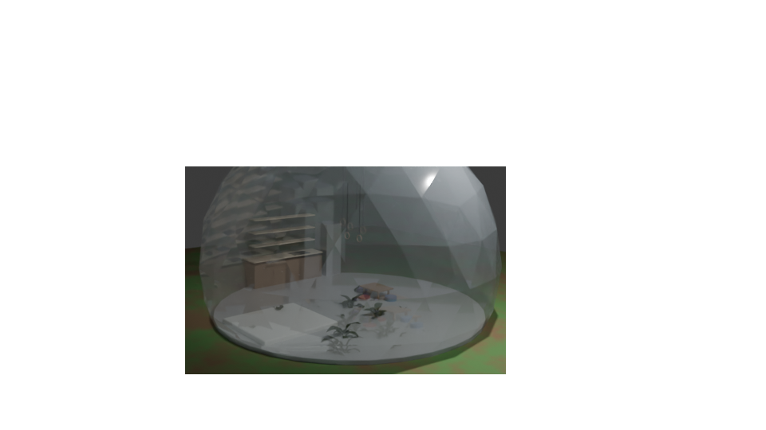
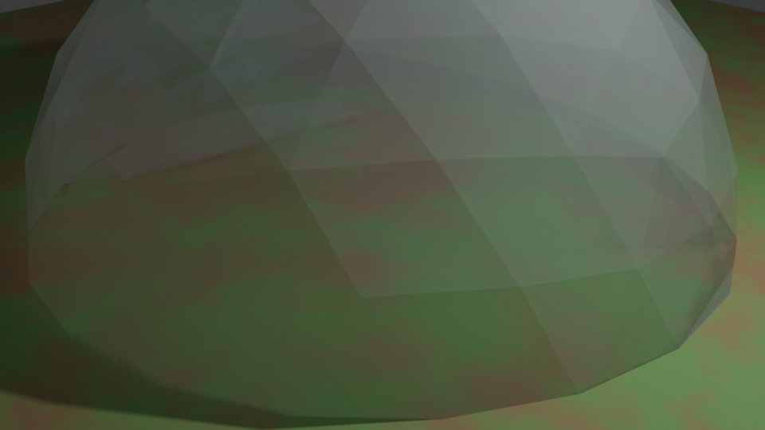
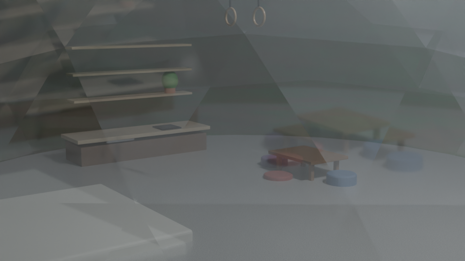
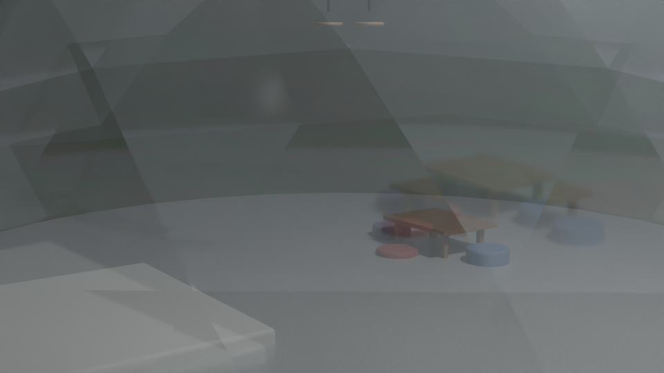
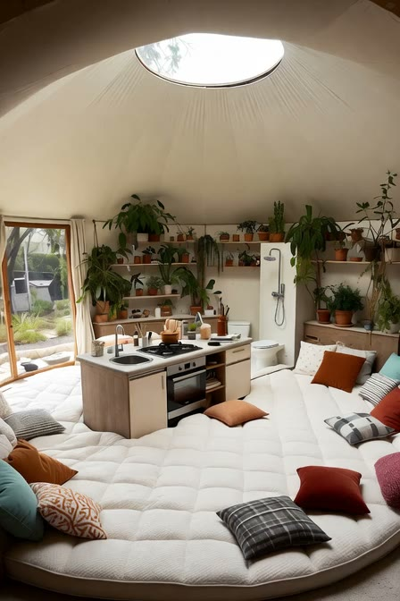
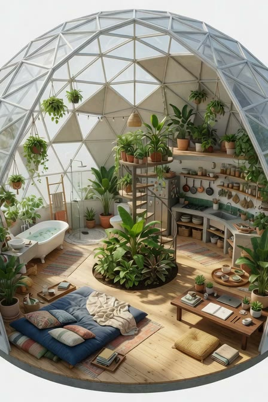
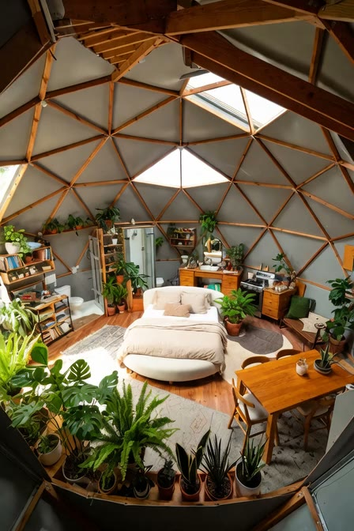

<div align="center">

# 🏠 The One-Room Dome

### One big multifunctional room under a 5/8-sphere geodesic shell.

Cook, sleep, bathe, move, and grow plants in a single daylit volume — a design
study, and an honest, cited resource for anyone thinking about building a dome.

**[🌐 Live site → crs48.github.io/dome](https://crs48.github.io/dome/)**



<sub><i>Author's Blender render — biophilic planting inside the 5/8-sphere shell.</i></sub>

</div>

---

## The idea

No hallways, no spare rooms. A dome collapses a house into a single volume, and
every function shares the same light:

| | |
|---|---|
| **⬡ Shell** | 5/8-sphere geodesic, translucent panels, a central oculus skylight |
| **⚭ Move** | Gymnastic rings, a climbing-net loft, wall bars, open floor |
| **❦ Nourish** | A perimeter kitchen and plants along the glazed band |
| **☾ Rest** | Floor cushions and a round, softly sunken bed |
| **≋ Bathe** | A freestanding tub, out in the daylight |
| **☀ Light** | Biophilic daylight from every angle |

## An honest iteration

The design was grown in Blender one layer at a time — a bare shell, then a
floor, a kitchen, furniture, rings, and plants.

<div align="center">



</div>

The renders are rough and honest work-in-progress. Alongside them, a set of
AI-generated "dollhouse" cutaways explore the same biophilic interior — **click a
frame to watch on the live site**:

<div align="center">
<a href="https://crs48.github.io/dome/gallery"></a>
<a href="https://crs48.github.io/dome/gallery"></a>
<a href="https://crs48.github.io/dome/gallery"></a>
</div>

<sub>GitHub READMEs don't autoplay relative-path video, so these are poster
frames linking to the <a href="https://crs48.github.io/dome/gallery">live
gallery</a>, where all 15 clips play.</sub>

## Build methods — the honest comparison

Plenty of sites *sell* domes; few compare them honestly. Full per-method
pros/cons, uncertainty flags, and sources live on the
[Build Methods](https://crs48.github.io/dome/methods) page.

| Method | Cost | Insulation | DIY | Light | Best use |
|---|---|---|---|---|---|
| **Aircrete** (Domegaia) | ~$1–2/sq-ft·in (material) | ~R-2/in realistic (marketed ~R-6 disputed) | High | Opaque | Cheap DIY off-grid shell, dry climate |
| **Shotcrete / Monolithic** | ~$130–250/sq ft | ~R-30–60 + mass | Low | Opaque | Max disaster resistance, long life |
| **Timber geodesic** | ~$120 (DIY) – $350/sq ft | High (R-30+); no mass | High | Opaque + skylights | DIY warm insulated home |
| **Polycarbonate geodesic** | Kit ~$3k–30k | ~R-2.8 (5-wall); poor | High | **Translucent** | Greenhouse, sunroom, glamping |
| **Glass geodesic** | Kit ~$4k–20k+ | Worst (~R-3–8) | Low | **Transparent** | Views, glamping, sunroom |
| **Binishell** (air-formed) | Shell $10–30/sq ft (prototypes) | Mass; needs insulation | No | Opaque | Rapid concrete shells (w/ engineering) |
| **Bioceramic** (Geoship) | GTM ~$90k–380k | Vendor claim (unverified) | No | Opaque (luminous) | Health/eco early-adopter kit |
| **Earthbag / SuperAdobe** (CalEarth) | Cheapest materials; labor-heavy | Low (mass ≠ insulation) | Highest | Opaque | Ultra-low-cost DIY, desert climates |

**Four honest caveats about dome living:** ① leaks are the defining dome problem
(seams, hubs, no drainage plane); ② sealed high-gain shells sweat without
ventilation; ③ curved walls are hard to furnish (expect built-ins); ④ resale,
financing, insurance, and code all take extra work.

## Resource directory

A curated, live-verified (July 2026) directory out to the best dome projects on
the internet — the full annotated version is on the
[Resources](https://crs48.github.io/dome/resources) page.

- **Bioceramic / next-gen:** [Geoship](https://geoship.is/)
- **Aircrete:** [Domegaia](https://domegaia.com/) · [Aircrete Harry](https://aircreteharry.com/) · [Steve Areen's dome](https://steveareen.com/domehome/)
- **Geodesic kits:** [Pacific Domes](https://pacificdomes.com/) · [Natural Spaces Domes](https://naturalspacesdomes.com/) · [Timberline Geodesics](https://www.domehome.com/) · [Ekodome](https://ekodome.com/) · [Growing Spaces](https://growingspaces.com/) · [Biodomes](https://biodomes.org/) · [FDomes](https://fdomes.com/) · [Intershelter](https://intershelter.com/)
- **Monolithic / concrete:** [Monolithic Dome Institute](https://www.monolithic.org/) · [Binishells](https://binishells.com/)
- **Earthbag:** [CalEarth](https://calearth.org/)
- **Fuller & theory:** [Buckminster Fuller Institute](https://www.bfi.org/) · [Montreal Biosphère](https://www.parcjeandrapeau.com/en/biosphere-environment-museum-montreal/) · [Eden Project](https://www.edenproject.com/)
- **Inspiration:** [Hjertefølger Nature House](https://mymodernmet.com/hjertefolger-arctic-circle-cob-house/) · [Domerama](http://www.domerama.com/)
- **Geometry / software:** [Desert Domes calculator](https://www.desertdomes.com/domecalc.html) · [Acidome calculator](https://acidome.com/lab/calc/) · [Blender Geodesic Domes add-on](https://extensions.blender.org/add-ons/geodesic-domes/) · [Zip Tie Domes](https://www.ziptiedomes.com/)

## Build & deploy

This is a static [Astro](https://astro.build/) 5 site styled with
[Tailwind CSS](https://tailwindcss.com/) v4.

```bash
npm install          # install dependencies
npm run dev          # local dev server
npm run build        # type-check + static build to dist/
npm run preview      # preview the built dist/ under the /dome/ base
npm run posters      # regenerate video poster frames (needs ffmpeg)
```

Every push to `main` is built and published to **GitHub Pages** by
[`.github/workflows/deploy.yml`](.github/workflows/deploy.yml)
(`withastro/action` → `actions/deploy-pages`). Because it's a project page
served from `/dome/`, `astro.config.mjs` sets `base: '/dome'`, and hand-written
links and `public/` assets are routed through `import.meta.env.BASE_URL`.

### Repository layout

```
├── .github/workflows/deploy.yml   # GitHub Pages CI
├── astro.config.mjs               # site + base:/dome + responsive images
├── public/videos/                 # 15 concept clips (+ posters/)
├── src/
│   ├── assets/renders/            # author's Blender PNG renders → <Image>/<Picture>
│   ├── content/                   # methods.yaml + projects.yaml (content collections)
│   ├── components/ · layouts/ · pages/
│   └── lib/                       # base-URL helper + media manifest
├── design/                        # .blend source files (downloadable)
└── docs/explorations/             # the exploration that specced this site
```

## License & attribution

- **Code** — MIT (see [`LICENSE`](LICENSE)).
- **Renders & `.blend` files & prose** — the author's own work, CC BY-NC 4.0
  (see [`LICENSE-CONTENT`](LICENSE-CONTENT)).
- **AI concept clips** (`public/videos/`) — AI-generated studies; rights are
  unsettled. Reference only, not reusable stock.
- **Reference photo** (`2d/imagine-cbd1317c.jpg`) — appears to be a third
  party's copyrighted work. It inspired the project but is **deliberately not
  published on the site** pending licensing. If you're the rightsholder, please
  open an issue.

<div align="center"><sub>Built with Astro + Blender · warm paper, moss, clay, and daylight.</sub></div>
