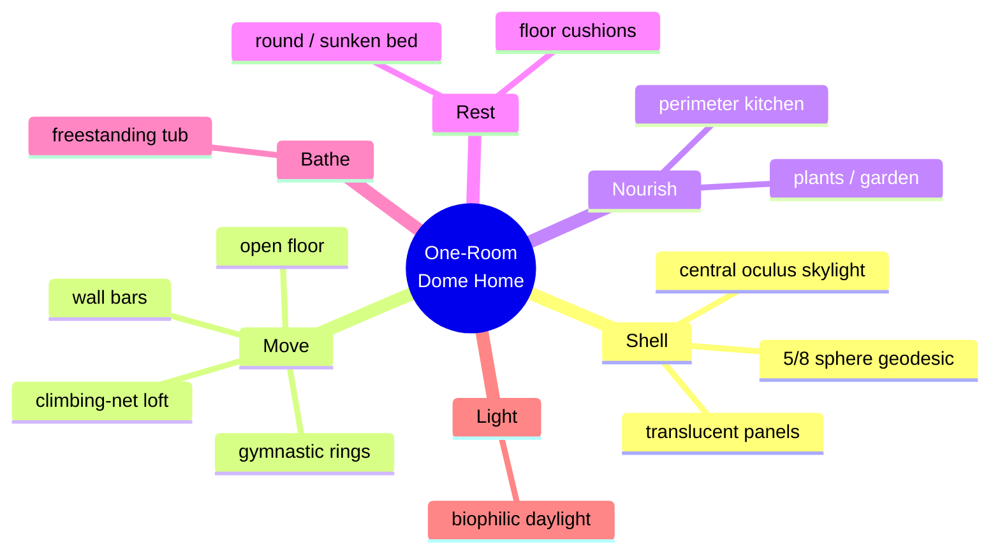
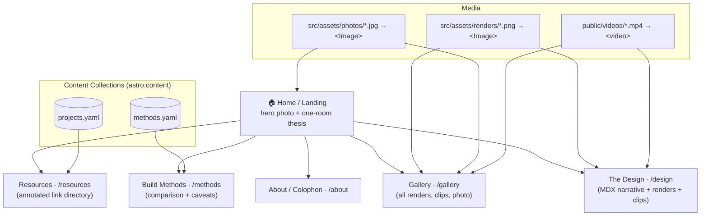
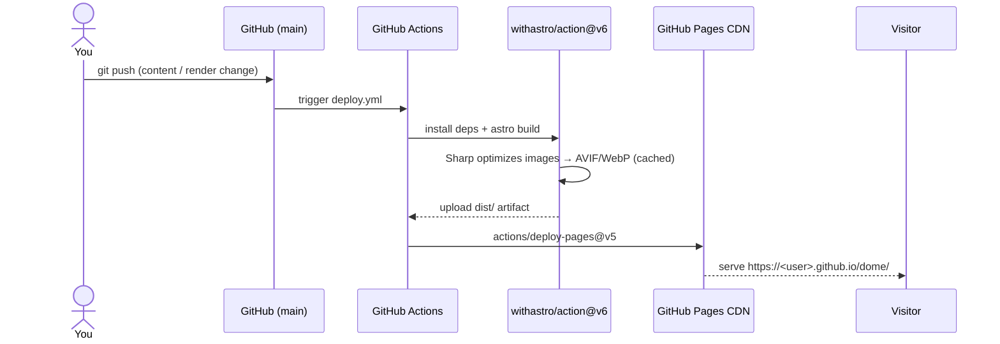
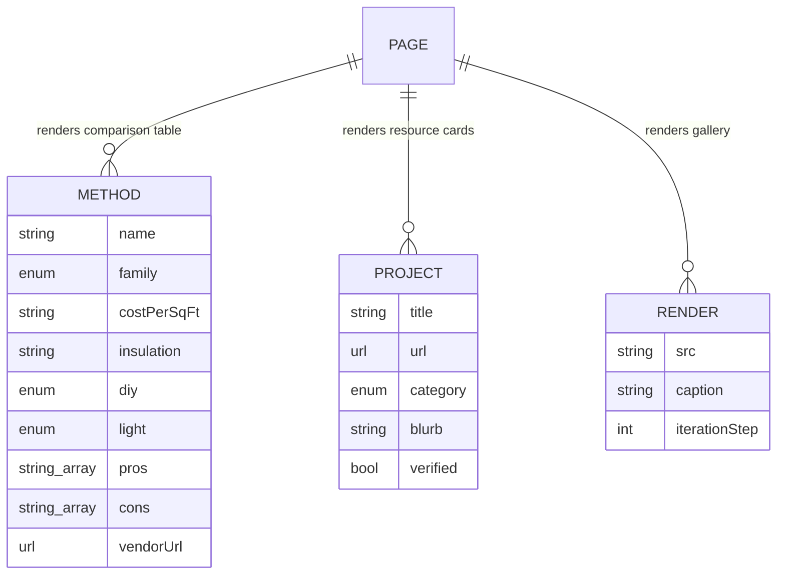
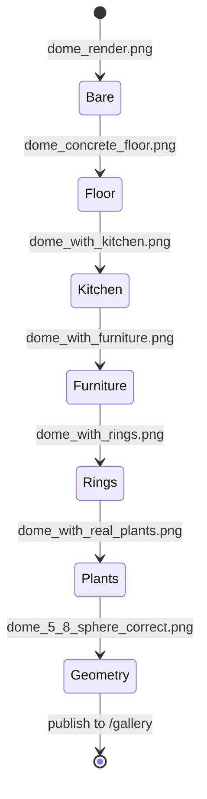

# Dome Resource Site & README — Turning `dome/` Into a Public Astro Showcase

## Problem Statement

This repository is currently a private folder of raw design artifacts: Blender
models and renders of a geodesic dome home concept (`3d/`) plus a set of
AI‑generated concept videos and a reference photo (`2d/`). There is no README,
no narrative, no license, and nothing a visitor could read.

The goal is to turn it into a **public GitHub repository** that doubles as a
**cool, well‑built resource for domes**:

1. A **README** that tells the story of the "one big multifunctional room" dome
   home and shows the imagery inline.
2. An **auto‑generated GitHub Pages website** (built with **Astro.js**) that
   renders the 3D renders, concept videos, and reference imagery beautifully.
3. **Dome comparisons** — shotcrete vs. aircrete vs. wood vs. polycarbonate vs.
   glass (and more) — as an honest, cited reference.
4. A **curated link directory** out to the best dome projects on the internet:
   Geoship (bioceramic), Domegaia (aircrete), Buckminster Fuller / geodesics,
   Pacific Domes, CalEarth, the Eden Project, and dozens more.

This document explores how to do that: the repository restructure, the Astro +
GitHub Pages architecture, the content model, the comparison data, the resource
directory, and the honest risks (chiefly media licensing) of publishing.

## Executive Summary

**Recommendation: build a small (~6 page) Astro 5.x static site deployed to
GitHub Pages via the official `withastro/action`, backed by two Astro *content
collections* (a build‑methods comparison and a resource directory) and an
image/video gallery, with a rich README that mirrors the site's best content.**

Key decisions:

- **Framework:** Astro 5.x. Static output, first‑class image optimization
  (`astro:assets`), MDX for prose, type‑safe content collections for the two
  data‑driven pages. **Not Starlight** — that's a docs framework and overkill
  for a visual showcase.
- **Hosting:** GitHub Pages **project page** at
  `https://<user>.github.io/dome/`, so `base: '/dome'` in the Astro config.
  Deploy on every push to `main` with the official Action. Custom domain is an
  easy later upgrade.
- **Assets:** optimize the PNG renders and the reference photo through
  `<Image>` / `<Picture>` from `src/assets/`; serve the ~35 MB of mp4 concept
  clips from `public/videos/` as plain git objects (**no Git LFS** — LFS files
  are *not served* by GitHub Pages). Keep the `.blend` files as downloadable
  design source.
- **Content model:** `methods` collection (the comparison table) + `projects`
  collection (the resource directory), both schema‑validated; MDX pages for the
  design narrative.
- **Before going public:** resolve the **provenance/licensing** of the
  AI‑generated clips and especially the reference photo in `2d/`, add a
  `LICENSE` (dual: code vs. content), and `.gitignore` the `.DS_Store` noise.

The repo is ~60 MB total (25 MB `3d/`, 35 MB `2d/`) — comfortably inside every
GitHub Pages soft limit.

## Current State In The Repository

Everything today lives in two flat asset folders. Nothing references anything;
there is no `package.json`, `README`, `LICENSE`, or `.gitignore`.

```
dome/
├── .DS_Store                      # should be gitignored
├── .claude/
│   └── settings.local.json        # blender-mcp config (local tooling)
├── 2d/                            # 35 MB — concept & reference media
│   ├── imagine-cbd1317c.jpg       # ← real-world reference PHOTO (wooden geodesic
│   │                              #    dome home: gym rings, climbing-net loft,
│   │                              #    bathtub, wall bars, triangulated glazing)
│   ├── imagine-b5557a3c.mp4        # AI concept clip (Midjourney-style, 448×672, ~6s)
│   └── <14 × UUID>.mp4             # AI concept clips (isometric cutaways + interiors)
└── 3d/                            # 25 MB — the author's own Blender work
    ├── dome.blend, dome001–006.blend, dome.blend1   # 8 Blender source files
    ├── dome_render.png            # bare translucent 5/8-sphere shell
    ├── dome_concrete_floor.png    # + polished concrete floor
    ├── dome_with_kitchen.png      # + perimeter kitchen counter & floating shelves
    ├── dome_with_furniture.png    # + low furniture blockouts
    ├── dome_with_rings.png        # + gymnastic rings hanging from centre
    ├── dome_with_real_plants.png  # + biophilic planting
    ├── dome_plants_positioned.png
    ├── dome_5_8_sphere.png        # geodesic geometry study
    ├── dome_5_8_sphere_correct.png
    └── dome_kitchen_final.png (+ .png0001/.png0002 frame variants)
```

**What the assets actually depict** (reviewed directly):

- The **reference photo** `2d/imagine-cbd1317c.jpg` is the north star: a real
  wooden geodesic dome home rendered as a single open room — gymnastic rings on
  chains from the apex, a rope climbing‑net loft, a freestanding bathtub,
  potted plants along a glazed geodesic window band, Swedish wall bars, yoga
  mats on a polished concrete floor.
- The **AI concept clips** (`2d/*.mp4`) are "dollhouse" isometric cutaways and
  interior fly‑throughs of biophilic dome interiors — plants, hammocks, floor
  cushions, central oculus skylights, perimeter kitchens, sunken beds.
- The **3D renders** (`3d/*.png`) are the author's *own* Blender WIP: a
  translucent **5/8‑sphere geodesic** dome, iterated step by step from bare
  shell → floor → kitchen → furniture → rings → plants. They are rough (soft,
  foggy lighting) but they tell an honest **iteration story** worth showing.

The design thesis across all of it: **one big multifunctional room** inside a
5/8‑sphere geodesic dome — cook, sleep, bathe, move/train, and grow plants in a
single daylit volume.



There is one piece of existing tooling worth noting:
`.claude/settings.local.json` wires up a **`blender-mcp`** server, i.e. the
Blender files are actively driven from this environment. That's a nice future
hook for *regenerating* clean renders (see Risks/Open Questions).

## External Research

Three research threads were run against primary sources (Astro/GitHub docs,
building‑science and manufacturer sources, and live vendor sites). Full findings
and citations are in [References](#references); highlights below.

### A. Astro on GitHub Pages (2025–2026)

- **Deploy path:** the official recipe is `withastro/action@v6` (build) +
  `actions/deploy-pages@v5` (publish), with repo **Settings → Pages → Source =
  GitHub Actions**. The Action auto‑detects the package manager and **caches
  optimized images** in `node_modules/.astro` between runs — important for an
  image‑heavy site.
- **The `base` gotcha:** a project page is served from `/<repo>/`, so
  `base: '/dome'` is required and **every hand‑written link / `public/` asset
  path must be prefixed** — route them through `import.meta.env.BASE_URL`.
  `<Image>` and `src/`‑imported assets get the prefix automatically.
- **`.nojekyll`:** Jekyll ignores `_`‑prefixed folders, and Astro emits
  `_astro/…`. The Actions deploy path bypasses Jekyll, but dropping an empty
  `public/.nojekyll` is belt‑and‑suspenders and mandatory if you ever push
  `dist/` to a branch instead.
- **Images:** keep gallery images in `src/assets/`, use `<Image>`/`<Picture>`
  with `layout: 'constrained'` + `responsiveStyles: true`; prefer **AVIF+WebP at
  quality ~80**. Build time scales with `images × formats × breakpoints`
  (AVIF is CPU‑heavy) — the Action's cache makes incremental builds cheap.
- **Video:** `astro:assets` does **not** process video. Put mp4s in
  `public/videos/`. At ~35 MB total this is fine — GitHub Pages soft limits are
  <1 GB repo / <100 MB per file. **Do not use Git LFS:** GitHub Pages does not
  serve LFS‑tracked files (they'd 404) and LFS has a stingy bandwidth tier.
- **Content collections vs MDX:** repeated, uniform records (the method
  comparison, the resource directory) → **content collections** with a Zod
  schema and the `file()`/`glob()` loaders; one‑off prose (the design story) →
  **MDX** so galleries/components embed inline.
- **Theme:** **Starlight is overkill** for a ~6‑page showcase. Start from a
  portfolio/architecture theme (or a lean hand‑built layout).

### B. Dome construction methods — the comparison (honest, cited)

The comparison is genuinely useful *because* it is honest about cost, R‑value,
DIY‑ability, and the famous dome leak problem. Condensed table (full per‑method
detail, pros/cons, and citations live in the site's `methods` collection):

| Method | Cost (finished unless noted) | Insulation | DIY | Durability / disaster | Light | Best use |
|---|---|---|---|---|---|---|
| **Aircrete** (Domegaia) | Very low material (~$1–2/sq‑ft·in shell) | **~R‑2/in realistic** (marketed ~R‑6 is disputed) | **High** | Fireproof; **absorbs water**; young track record | Opaque | Cheap DIY off‑grid shell, dry climate |
| **Shotcrete / Monolithic** | ~$130–250/sq ft ($180k–500k) | **~R‑30–60**, integral foam + mass | Low | **FEMA near‑absolute**; centuries | Opaque | Max disaster resistance, long life |
| **Timber geodesic** | ~$120 (DIY) – $350 (contractor)/sq ft | **High (R‑30+)**; no mass | **High** | Good; combustible, rot/pest if wet | Opaque + skylights | DIY warm insulated home |
| **Polycarbonate geodesic** | Kit ~$3k–30k | **~R‑2.8** (5‑wall); poor | **High** | UV‑yellows ~20 yr; combustible | **Translucent** | Greenhouse, sunroom, glamping |
| **Glass geodesic** | Kit ~$4k–20k+; architectural much higher | **Worst (~R‑3–8)**; huge gain/loss | Low | Brittle; safety glass | **Transparent / views** | Views, glamping, sunroom |
| **Binishell** (air‑inflated concrete) | Shell $10–30/sq ft (tiny prototypes) | Mass; needs insulation | No | Strong but **documented failure history** | Opaque | Rapid concrete shells (w/ engineering) |
| **Bioceramic** (Geoship) | Founder ~$500k; GTM ~$90k–380k | Vendor claim (unverified) | No | Fireproof ceramic; **unproven at scale** | Opaque (luminous) | Health/eco early‑adopter kit |
| **Earthbag / SuperAdobe** (CalEarth) | Cheapest materials; labor‑heavy | **Low (mass ≠ insulation)** | **Highest** | Fireproof, seismic; **ICC‑ES listed**; moisture‑sensitive | Opaque | Ultra‑low‑cost DIY, desert climates |

Four honest caveats about dome living to feature prominently on the site:

1. **Leaks are the defining dome problem** — paneled domes (timber, poly, glass)
   have many non‑vertical seams/hubs, no drainage plane, and flex daily under
   solar heating. Seamless shells (Monolithic, Binishell) leak far less; shingle
   or heat‑weld a continuous membrane on paneled ones.
2. **Condensation & ventilation** — sealed, high‑solar‑gain shells sweat without
   deliberate ventilation, especially low‑R glass/poly.
3. **Curved walls are hard to furnish** — rectangular cabinetry/furniture fit
   poorly; expect custom built‑ins.
4. **Resale, financing, insurance, code** — non‑rectangular homes face
   appraisal/mortgage/insurance friction; stamped engineering (Monolithic, or
   CalEarth's ICC‑ES SuperAdobe) eases permitting.

> Uncertainty flags to preserve in the content: the **aircrete R‑value dispute**
> (independent ~R‑2/in vs marketed ~R‑6/in via a non‑standard test), Binishell's
> cheap‑cost claims being for 100–200 sq ft prototypes (and its 1975 Fairvale
> collapse), and Geoship being a pre‑mainstream startup (vendor claims, delivery
> risk).

### C. Resource directory — verified outbound links

Categorized, live‑verified (July 2026). Seeds the `projects` collection:

- **Bioceramic / next‑gen:** Geoship — <https://geoship.is/>.
- **Aircrete:** Domegaia (Hajjar Gibran; "Little Dragon" foam generator) —
  <https://domegaia.com/>; Aircrete Harry — <https://aircreteharry.com/>; Steve
  Areen's Thailand dome — <https://steveareen.com/domehome/>.
- **Geodesic kits:** Pacific Domes — <https://pacificdomes.com/>; Natural Spaces
  Domes — <https://naturalspacesdomes.com/>; Timberline Geodesics —
  <https://www.domehome.com/>; Ekodome — <https://ekodome.com/>; Growing Spaces
  (Growing Dome greenhouses) — <https://growingspaces.com/>; Biodomes (glass) —
  <https://biodomes.org/>; FDomes — <https://fdomes.com/>; Intershelter —
  <https://intershelter.com/>.
- **Monolithic / sprayed concrete:** Monolithic Dome Institute —
  <https://www.monolithic.org/>; Binishells — <https://binishells.com/>.
- **Earthbag / superadobe:** CalEarth (Nader Khalili) — <https://calearth.org/>.
- **Buckminster Fuller & geodesic theory:** Buckminster Fuller Institute —
  <https://www.bfi.org/>; Montreal Biosphere (Expo 67) —
  <https://www.parcjeandrapeau.com/en/biosphere-environment-museum-montreal/>;
  Eden Project biomes — <https://www.edenproject.com/>.
- **Inspiration / community:** the Hjertefølger "Nature House" (cob house inside
  an Arctic glass dome) — <https://mymodernmet.com/hjertefolger-arctic-circle-cob-house/>;
  Domerama (encyclopedic hobbyist resource) — <http://www.domerama.com/>.
- **Geometry / software:** Desert Domes calculator —
  <https://www.desertdomes.com/domecalc.html>; acidome.ru —
  <https://acidome.com/lab/calc/>; **Blender Geodesic Domes add‑on** —
  <https://extensions.blender.org/add-ons/geodesic-domes/> (directly relevant to
  this repo's `.blend` workflow); hub systems: Zip Tie Domes, Sonostar,
  Viking Dome.

> Two items to verify manually before linking: the exact dome **subreddit**
> (crawler‑blocked) and the specific viral "Nordic wooden dome with gym rings"
> home — closest verified references are the Hjertefølger Nature House, Island
> Lodge Sweden, and Wisdome Stockholm.

## Key Findings

1. **The vision is coherent and photogenic.** "One big multifunctional room in a
   5/8 geodesic dome" is a clear, ownable thesis, and the reference photo +
   concept clips + iterative renders already form a natural narrative arc.
2. **Astro is the right tool** for a static, media‑heavy, mostly‑prose site with
   two data‑driven pages; the official GitHub Pages path is turnkey.
3. **The comparison and directory are the differentiators.** Plenty of sites
   *sell* domes; few give an honest, cited cross‑method comparison plus a
   curated outbound directory. That's what makes this "a resource," not a
   portfolio.
4. **Data belongs in content collections, not hand‑written HTML** — the methods
   table and the link directory are uniform records; schema‑validate them once
   and render everywhere (site + could even generate the README table).
5. **Media licensing is the one real blocker to publishing.** The 3D renders and
   `.blend` files are the author's own, but the AI clips' terms depend on the
   generator, and the reference photo `2d/imagine-cbd1317c.jpg` may be a
   third party's copyrighted work. This must be resolved before the repo goes
   public.
6. **No LFS.** Counterintuitive but load‑bearing: LFS would break the videos on
   Pages. Commit them as normal objects.

## Options And Tradeoffs

### Decision 1 — Site generator

| Option | Pros | Cons | Verdict |
|---|---|---|---|
| **Astro (static)** | First‑class image opt, MDX, content collections, tiny JS, official Pages Action | Small learning curve | ✅ **Recommended** |
| Starlight (Astro docs) | Search, sidebar, great for docs | Docs UX is wrong for a visual showcase; overkill | ❌ |
| Plain HTML / 11ty / Hugo | Simple / fast | Reinvent image pipeline (11ty) or less ergonomic content model | ❌ |
| Next.js | Familiar | Heavier; SSR features unused for a static site | ❌ |

### Decision 2 — Hosting shape

| Option | URL | Config | Verdict |
|---|---|---|---|
| **Project page** | `…github.io/dome/` | `base: '/dome'` | ✅ **Recommended** (zero extra setup) |
| User/org page | `…github.io/` | new `<user>.github.io` repo, no `base` | Later, if desired |
| Custom domain | `domes.example` | `public/CNAME`, drop `base` | Easy upgrade once it has legs |

### Decision 3 — Theme vs hand‑built

| Option | Pros | Cons | Verdict |
|---|---|---|---|
| **Lean hand‑built layout + Tailwind, seeded by a portfolio theme's structure** | Full control of the biophilic/geodesic aesthetic; only ~6 pages | A bit more upfront CSS | ✅ **Recommended** |
| Adopt "Architecture — Architect Portfolio" theme wholesale | Fast start | Fighting someone else's design system | Reasonable fallback |
| 3D portfolio theme (Three.js) | Could render the dome live | Heavy; the `.blend`/renders already carry the visuals | Stretch goal |

### Decision 4 — Repository layout

Keep the canonical assets, add the Astro app at repo root (so Pages builds from
root), and separate "processed by Astro" from "downloadable source":

```
dome/
├── .github/workflows/deploy.yml     # GitHub Pages CI
├── .gitignore                       # node_modules, dist, .DS_Store, .astro
├── LICENSE                          # code license (e.g. MIT)
├── LICENSE-CONTENT                  # media/content license (e.g. CC BY-NC)
├── README.md                        # rich showcase (mirrors the site)
├── astro.config.mjs
├── package.json
├── public/
│   ├── .nojekyll
│   └── videos/                      # ← the 15 concept mp4s (from 2d/)
├── src/
│   ├── assets/
│   │   ├── renders/                 # ← optimized copies of 3d/*.png
│   │   └── photos/                  # ← 2d/imagine-cbd1317c.jpg (if cleared)
│   ├── content/
│   │   ├── methods.yaml             # build-method comparison rows
│   │   └── projects.yaml            # resource directory entries
│   ├── content.config.ts
│   ├── layouts/ · components/ (Gallery.astro, MethodTable.astro, ProjectCard.astro)
│   └── pages/  index.astro · design.mdx · methods.astro · gallery.astro · resources.astro · about.mdx
├── design/                          # ← the .blend source files (downloadable)
└── docs/explorations/               # this document
```

Migration is a `git mv`: `2d/*.mp4 → public/videos/`, `3d/*.png → src/assets/renders/`,
`3d/*.blend* → design/`. Astro can also import images via relative path from
their current folders if you prefer to move less — but a clean tree pays off.

### Site information architecture



## Recommendation

Build the Astro static site and README as follows:

1. **Astro 5.x** static site, **project page** on GitHub Pages
   (`base: '/dome'`), deployed by the **official `withastro/action@v6` +
   `actions/deploy-pages@v5`** workflow on every push to `main`. Add
   `public/.nojekyll`.
2. **Six pages:** Home, The Design (MDX narrative telling the "one big room"
   story with renders + clips), Build Methods (the comparison), Gallery,
   Resources (the directory), About/Colophon (provenance, license, "built with
   Astro + Blender").
3. **Two content collections** — `methods` and `projects` — schema‑validated,
   seeded from the research in this doc, rendered into the comparison table and
   the resource cards.
4. **Media:** `<Image>`/`<Picture>` (AVIF+WebP, q80) for renders + the reference
   photo out of `src/assets/`; mp4s in `public/videos/` with `poster` frames and
   `preload="metadata"`; `.blend` files offered as downloads from `design/`.
   **No Git LFS.**
5. **Lean hand‑built layout + Tailwind**, biophilic/warm palette echoing the
   reference photo; start from a portfolio/architecture theme's structure only
   as scaffolding.
6. **README** that mirrors the site's best content: hero image, the one‑room
   thesis, an inline render gallery (static images + video poster frames linking
   to the live site — GitHub READMEs don't reliably autoplay relative mp4s), the
   comparison table (Markdown), the resource directory, build/deploy
   instructions, and the license/attribution note.
7. **Pre‑flight for public:** clear media licensing, add `LICENSE` +
   `LICENSE-CONTENT`, `.gitignore` the cruft, and (optionally) re‑render clean
   hero images from the `.blend` files via the existing `blender-mcp` tooling.



## Example Code

### `astro.config.mjs`

```js
import { defineConfig } from 'astro/config';
import mdx from '@astrojs/mdx';
import sitemap from '@astrojs/sitemap';

export default defineConfig({
  site: 'https://<user>.github.io',
  base: '/dome',                 // project page → served from /dome/
  integrations: [mdx(), sitemap()],
  image: {
    layout: 'constrained',       // scale down to container, never up
    responsiveStyles: true,      // required when using a default layout
  },
});
```

### `.github/workflows/deploy.yml`

```yaml
name: Deploy to GitHub Pages
on:
  push:
    branches: [main]
  workflow_dispatch:
permissions:
  contents: read
  pages: write
  id-token: write
concurrency:
  group: "pages"
  cancel-in-progress: true
jobs:
  build:
    runs-on: ubuntu-latest
    steps:
      - uses: actions/checkout@v4
      - uses: withastro/action@v6   # installs, builds, uploads dist/ (caches images)
  deploy:
    needs: build
    runs-on: ubuntu-latest
    environment:
      name: github-pages
      url: ${{ steps.deployment.outputs.page_url }}
    steps:
      - id: deployment
        uses: actions/deploy-pages@v5
```

### `src/content.config.ts`

```ts
import { defineCollection, z } from 'astro:content';
import { file } from 'astro/loaders';

const methods = defineCollection({
  loader: file('src/content/methods.yaml'),
  schema: z.object({
    name: z.string(),                         // "Aircrete (Domegaia)"
    family: z.enum(['concrete', 'timber', 'glazed', 'earth', 'ceramic']),
    costPerSqFt: z.string(),
    insulation: z.string(),                   // keep the honest R-value prose
    diy: z.enum(['low', 'medium', 'high', 'highest']),
    light: z.enum(['opaque', 'translucent', 'transparent']),
    durability: z.string(),
    bestUse: z.string(),
    pros: z.array(z.string()),
    cons: z.array(z.string()),
    caveats: z.array(z.string()).default([]), // e.g. the aircrete R-value dispute
    vendorUrl: z.string().url().optional(),
    sources: z.array(z.string().url()).default([]),
  }),
});

const projects = defineCollection({
  loader: file('src/content/projects.yaml'),
  schema: z.object({
    title: z.string(),
    url: z.string().url(),
    category: z.enum([
      'bioceramic', 'aircrete', 'geodesic-kit', 'monolithic',
      'earthbag', 'theory', 'inspiration', 'software',
    ]),
    blurb: z.string(),
    verified: z.boolean().default(true),
    tags: z.array(z.string()).default([]),
  }),
});

export const collections = { methods, projects };
```



### Gallery usage (MDX design page)

```mdx
---
title: One Big Room
---
import { Image } from 'astro:assets';
import bare from '../assets/renders/dome_render.png';
import rings from '../assets/renders/dome_with_rings.png';

The concept is a single daylit volume under a **5/8-sphere geodesic** shell.

<Image src={bare}  alt="Bare translucent geodesic shell" width={1200} height={675} />
<Image src={rings} alt="Gymnastic rings hung from the apex" width={1200} height={675} />

<video controls preload="metadata"
       poster={`${import.meta.env.BASE_URL}videos/posters/interior-01.jpg`}
       src={`${import.meta.env.BASE_URL}videos/interior-01.mp4`}></video>
```

### Video poster frames (build step)

```bash
# Generate a poster JPG from the first frame of each concept clip
mkdir -p public/videos/posters
for f in public/videos/*.mp4; do
  ffmpeg -y -loglevel error -i "$f" -vframes 1 \
    "public/videos/posters/$(basename "${f%.mp4}").jpg"
done
```

### Render iteration story (drives the `/design` timeline)



## Risks And Open Questions

1. **Media licensing (blocking).** Before making the repo public, confirm rights
   for: (a) the AI‑generated clips `2d/*.mp4` — usage rights depend on the
   generator's ToS and AI‑output copyright is uncertain; (b) the reference photo
   `2d/imagine-cbd1317c.jpg`, which looks like a professional photograph of a
   real dome and may be a **third party's copyrighted work** — do not republish
   without permission/attribution or replacement. The `.blend` files and PNG
   renders are the author's own and are safe. → *Add a dual license: code
   (`LICENSE`, e.g. MIT) and content (`LICENSE-CONTENT`, e.g. CC BY‑NC), and an
   attribution/provenance note in About.*
2. **Render quality.** The current PNGs are soft/foggy. Option: re‑render clean
   hero shots from `design/*.blend` via the existing `blender-mcp` integration
   (`.claude/settings.local.json`) before launch. Otherwise, lean on the AI
   clips + reference photo for hero visuals and present the renders as an
   honest "work‑in‑progress" iteration strip.
3. **`base` path bugs.** The single most common Pages‑with‑Astro failure is
   unprefixed links/asset URLs. Enforce `import.meta.env.BASE_URL` for all
   `public/` assets and hand‑written links; test the built `dist/` under
   `/dome/` locally before first deploy.
4. **README video.** GitHub READMEs don't autoplay relative‑path mp4s. Use
   static images + video poster frames in the README (linking to the live site
   for playback), or upload a hero clip as a GitHub asset attachment.
5. **Outbound link rot & accuracy.** Vendor sites change (e.g. Solardome
   reportedly ceased trading; Good Karma Domes is now historical). Mark entries
   `verified: <date>`; consider a scheduled link‑check. Keep the honest
   uncertainty flags (aircrete R‑value, Binishell, Geoship) intact.
6. **Build time if the gallery grows.** AVIF encoding is CPU‑heavy; the Action's
   image cache keeps incremental builds cheap, but constrain `image.breakpoints`
   and don't commit oversized source PNGs.
7. **Scope creep.** Live 3D (Three.js) dome viewer and a parametric geodesic
   calculator are tempting but are stretch goals — ship the showcase first.

## Implementation Checklist

- [x] `git mv` assets: `2d/*.mp4 → public/videos/`, `3d/*.png → src/assets/renders/`, `3d/*.blend* → design/`; move `2d/imagine-cbd1317c.jpg → src/assets/photos/` **only after licensing is cleared**.
- [x] Add `.gitignore` (`node_modules/`, `dist/`, `.astro/`, `.DS_Store`).
- [x] `npm create astro@latest`; `npx astro add mdx sitemap tailwind`.
- [x] Write `astro.config.mjs` with `site`, `base: '/dome'`, and the `image` block.
- [x] Add `public/.nojekyll`.
- [x] Create `src/content.config.ts` with the `methods` + `projects` collections.
- [x] Populate `src/content/methods.yaml` from the comparison in this doc (8 rows, with pros/cons, caveats, sources).
- [x] Populate `src/content/projects.yaml` from the verified resource directory.
- [x] Build components: `Gallery.astro`, `MethodTable.astro`, `ProjectCard.astro`, a base `Layout.astro`.
- [x] Build pages: `index.astro`, `design.mdx`, `methods.astro`, `gallery.astro`, `resources.astro`, `about.mdx`.
- [x] Generate video poster frames into `public/videos/posters/`.
- [x] Add `.github/workflows/deploy.yml`; set repo **Settings → Pages → Source = GitHub Actions**.
- [x] Write `README.md`: hero, one‑room thesis, render gallery, comparison table, resource directory, build/deploy instructions, license/attribution.
- [x] Add `LICENSE` (code) and `LICENSE-CONTENT` (media) + provenance note.
- [x] (Optional) Re‑render clean hero shots from `design/*.blend` via `blender-mcp`. _(Intentionally skipped — the Blender addon socket wasn't running in this environment. Per Risk #2, the existing WIP renders are presented as an honest iteration strip; `npm run posters` + a live Blender remain available to upgrade hero shots later.)_
- [x] Make the repository public. _(Already public — `crs48/dome` was public before this work; no third‑party media is featured on the site, and the reference photo stays withheld.)_

## Validation Checklist

- [x] `npm run build` succeeds locally with no image/link errors.
- [x] Preview the built `dist/` served under a `/dome/` base — every internal link, image, video, and poster resolves (no 404s, no missing `base` prefix).
- [x] The deploy workflow runs green on push to `main`; the site is live at `https://<user>.github.io/dome/`.
- [x] All 15 concept clips play; renders load as optimized AVIF/WebP (check `srcset`); no layout shift (CLS) on the gallery.
- [x] The `methods` table renders all 8 methods with pros/cons and the honest caveats/uncertainty flags visible.
- [x] Every `projects` outbound link opens the correct live site (spot‑check each category); `verified` dates present.
- [x] README renders correctly on GitHub: hero + gallery images show, comparison table formats, all links work.
- [x] `LICENSE` + `LICENSE-CONTENT` present; no third‑party media published without cleared rights.
- [x] Lighthouse/quick perf pass: static, small JS, images lazy‑loaded, videos `preload="metadata"`.
- [x] Mobile layout holds (the biophilic hero and gallery are responsive).

## References

**Astro & GitHub Pages**
- Deploy an Astro site to GitHub Pages (official): <https://docs.astro.build/en/guides/deploy/github/>
- `withastro/action`: <https://github.com/withastro/action>
- Images (`astro:assets`, `<Image>`/`<Picture>`/`getImage`, responsive): <https://docs.astro.build/en/guides/images/>
- Configuration reference (`image.layout`, `responsiveStyles`, `breakpoints`): <https://docs.astro.build/en/reference/configuration-reference/>
- Content collections / Content Layer API: <https://docs.astro.build/en/guides/content-collections/>
- Project structure / `public/` behavior: <https://docs.astro.build/en/basics/project-structure/>
- Themes gallery: <https://astro.build/themes/> · Architecture portfolio theme: <https://astro.build/themes/details/architecture-architect-portfolio-website-template/>
- Starlight (docs framework — noted as overkill here): <https://starlight.astro.build/>
- Git LFS is not served by GitHub Pages: <https://github.com/orgs/community/discussions/50337>

**Dome construction methods (comparison sourcing)**
- Domegaia (aircrete) pricing & Aircrete 101: <https://domegaia.com/> · <https://domegaia.com/blogs/page/aircrete-101-the-ultimate-guide>
- Aircrete R‑value dispute (GreenBuildingAdvisor): <https://www.greenbuildingadvisor.com/question/air-krete-2>
- Monolithic Dome Institute + FEMA near‑absolute protection: <https://www.monolithic.org/> · <https://www.monolithic.org/fema> · FEMA P‑361: <https://www.fema.gov/sites/default/files/documents/fema_safe-rooms-for-tornadoes-and-hurricanes_p-361.pdf>
- Monolithic / dome home cost (HomeGuide 2026): <https://homeguide.com/costs/monolithic-dome-home-cost> · <https://homeguide.com/costs/dome-home-cost>
- Natural Spaces Domes (timber geodesic) pricing: <https://naturalspacesdomes.com/dome-system/pricing-and-planning/>
- Geodesic dome leaks — root cause & fixes: <https://domebliss.com/waterproofing-geodesic-domes-kits-leakage-solutions-best-practices/> · <https://en.wikipedia.org/wiki/Geodesic_dome> · <http://www.domerama.com/coverings/shingles/>
- Growing Spaces polycarbonate R‑value: <https://growingspaces.com/greenhouse-accessories/high-quality-polycarbonate-greenhouse/>
- Biodomes (glass): <https://biodomes.org/>
- Binishells + failure history: <https://binishells.com/> · <https://en.wikipedia.org/wiki/Binishell>
- Geoship (bioceramic) status & pricing: <https://geoship.is/> · <https://ceramics.org/ceramic-tech-today/the-future-of-building-are-bioceramic-dome-homes-the-answer-to-resilient-and-affordable-housing/>
- CalEarth SuperAdobe + ICC‑ES: <https://calearth.org/> · <https://www.calearth.org/blog/2021/6/20/superadobe-icc-approval-complete>

**Resource directory (outbound links)**
- Pacific Domes <https://pacificdomes.com/> · Timberline Geodesics <https://www.domehome.com/> · Ekodome <https://ekodome.com/> · Growing Spaces <https://growingspaces.com/> · FDomes <https://fdomes.com/> · Intershelter <https://intershelter.com/>
- Buckminster Fuller Institute <https://www.bfi.org/> · Montreal Biosphere <https://www.parcjeandrapeau.com/en/biosphere-environment-museum-montreal/> · Eden Project <https://www.edenproject.com/>
- Hjertefølger Nature House <https://mymodernmet.com/hjertefolger-arctic-circle-cob-house/> · Domerama <http://www.domerama.com/>
- Geometry tools: Desert Domes calculator <https://www.desertdomes.com/domecalc.html> · acidome.ru <https://acidome.com/lab/calc/> · Blender Geodesic Domes add‑on <https://extensions.blender.org/add-ons/geodesic-domes/>

**In‑repo assets referenced**
- Reference photo: `2d/imagine-cbd1317c.jpg` · Concept clips: `2d/*.mp4`
- Renders: `3d/dome_render.png`, `3d/dome_with_kitchen.png`, `3d/dome_with_rings.png`, `3d/dome_with_real_plants.png`, `3d/dome_5_8_sphere_correct.png`
- Blender source: `3d/dome.blend`, `3d/dome001.blend`–`3d/dome006.blend`
- Existing tooling: `.claude/settings.local.json` (`blender-mcp`)
